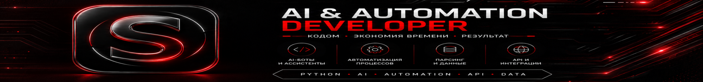

<p align="center">
  
</p>

<h1 align="center">🚀 Antigravity Toolkit</h1>

<p align="center">
Build Better Websites • Build Better Products • Build Better AI Systems
</p>

<p align="center">
Created by <b>Shax</b>
</p>

---

# 🇺🇸 English

## What is Antigravity Toolkit?

Antigravity Toolkit is a curated collection of:

- Skills
- System Instructions
- AI Prompts
- Workflows
- Design Standards
- Startup Frameworks

designed to improve Google AI Antigravity performance for modern development and product creation.

---

## Included

### 💻 Skills

- Web Development
- UI/UX Design
- Automation
- Startup Building
- Freelancing

### 🤖 Prompts

- Website Generator
- Landing Page Generator
- SaaS Builder
- AI Agent Builder

### ⚙️ Workflows

- Fullstack Project Workflow
- Startup MVP Workflow
- Client Project Workflow

### 🎨 Design Systems

- Apple UI
- Premium Design
- Dark Aesthetic
- Startup Thinking
- Coding Rules

---

## Design Philosophy

- Apple Inspired
- Premium UX/UI
- Dark Aesthetic
- Liquid Glass
- Modern SaaS Design
- Production Ready Code

### Preferred Colors

⚫ Black

⚪ White

🔴 Red

---

## Main Goal

Help AI build:

- Better websites
- Better SaaS products
- Better startups
- Better automations
- Better user experiences

---

## Repository Structure

```text
Antigravity-Toolkit
│
├── skills
├── prompts
├── workflows
├── system
├── examples
└── assets
```

---

## Future Roadmap

- Advanced AI Agent Systems
- SaaS Templates
- Startup Frameworks
- Modern UI Libraries
- Premium Landing Page Patterns
- Automation Blueprints

---

## Author

**Shax**

AI & Automation Developer

Building:
- AI Systems
- SaaS Products
- Telegram Bots
- Automations
- Modern Websites

---

# 🇷🇺 Русский

## Что такое Antigravity Toolkit?

Antigravity Toolkit — это набор навыков, инструкций, промптов и рабочих процессов для повышения качества работы Google AI Antigravity.

Проект помогает создавать:

- Современные сайты
- SaaS-продукты
- AI-сервисы
- Telegram-ботов
- Автоматизации
- MVP для стартапов

---

## Что входит

### Навыки

- Веб-разработка
- UI/UX дизайн
- Автоматизация
- Создание стартапов
- Фриланс

### Промпты

- Генератор сайтов
- Генератор лендингов
- SaaS Builder
- AI Agent Builder

### Рабочие процессы

- Fullstack проекты
- MVP стартапов
- Клиентские проекты

### Системы

- Apple UI
- Premium Design
- Dark Aesthetic
- Startup Thinking
- Coding Rules

---

## Философия проекта

Минимализм.

Премиальный дизайн.

Чистый код.

Реальные продукты.

Реальная польза.

---

## Автор

**Shax**

AI & Automation Developer

Создаю:

- AI-инструменты
- Автоматизации
- Telegram-ботов
- SaaS-сервисы
- Современные веб-приложения

---

⭐ If this project helps you, consider giving it a star.